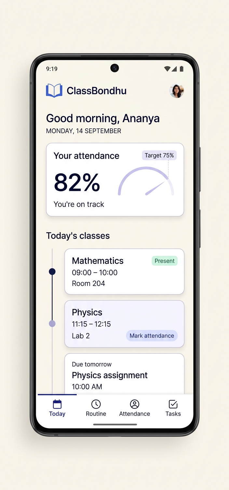

# ClassBondhu — Student Planner

A Flutter student companion for **class routines, subject-wise attendance, assignments, quizzes, and exams**. The first release is designed for college/university students, works offline, and supports **বাংলা (Bengali), English, and हिन्दी (Hindi)**.

> **Play Store title:** `ClassBondhu: Student Planner`
> **Android application ID:** `com.keshabstudios.classbondhu`
> **GitHub repository:** [Keshab1997/classbondhu-student-planner](https://github.com/Keshab1997/classbondhu-student-planner)
> The title is a working brand, not a trademark or Play Store availability guarantee. Check Play Console and trademark/domain availability before publishing.



## Product in one sentence

Help a student answer three questions quickly: **What is next today? Am I safe on attendance? What is due soon?**

## Planned v1 scope

- Four primary tabs: **Today, Routine, Attendance, Tasks**.
- Nine principal screens, detailed in [`docs/02-screen-map-and-user-flows.md`](docs/02-screen-map-and-user-flows.md).
- Subject-wise attendance, configurable target, history, and transparent calculations.
- Weekly timetable; attendance is marked with a one-tap Present/Absent action.
- Assignment/exam list, due dates, and local reminders.
- Bengali, English, and Hindi UI; student-entered subject names remain as entered.
- Offline-first local storage; no account or cloud sync in the first release.
- AdMob integration is a later, consent-aware milestone. Development uses Google's official test IDs only.

## Documentation sequence

Read and implement these in order; later docs depend on earlier product decisions:

1. [`docs/00-product-brief.md`](docs/00-product-brief.md)
2. [`docs/01-requirements-and-scope.md`](docs/01-requirements-and-scope.md)
3. [`docs/02-screen-map-and-user-flows.md`](docs/02-screen-map-and-user-flows.md)
4. [`docs/03-design-system-and-localization.md`](docs/03-design-system-and-localization.md)
5. [`docs/04-technical-architecture.md`](docs/04-technical-architecture.md)
6. [`docs/05-data-model-and-local-storage.md`](docs/05-data-model-and-local-storage.md)
7. [`docs/06-attendance-rules.md`](docs/06-attendance-rules.md)
8. [`docs/07-notifications.md`](docs/07-notifications.md)
9. [`docs/08-monetization-and-admob.md`](docs/08-monetization-and-admob.md)
10. [`docs/09-privacy-and-safety.md`](docs/09-privacy-and-safety.md)
11. [`docs/10-testing-and-acceptance.md`](docs/10-testing-and-acceptance.md)
12. [`docs/11-play-store-release.md`](docs/11-play-store-release.md)
13. [`docs/12-implementation-roadmap.md`](docs/12-implementation-roadmap.md)
14. [`docs/13-decisions-and-open-questions.md`](docs/13-decisions-and-open-questions.md)
15. [`docs/14-github-actions.md`](docs/14-github-actions.md)

## Current project status

**UI prototype phase.** Flutter source screens now live under `lib/`; the agreed first light-theme reference is in [`design/`](design/). The prototype includes the Today, Routine, Attendance, subject detail, Tasks, task editor, Settings, language selection, and subject setup screens. Sample state is in memory only: local database persistence, production notifications, AdMob, and generated Android runner scaffolding are not implemented yet. Flutter is not installed in the authoring sandbox, so the code and tests still need to be run on a machine with Flutter.

The app uses the confirmed Android application ID `com.keshabstudios.classbondhu`. Keep this exact ID in Play Console and Android build configuration.

## Run / verify (after Android platform scaffold is generated)

On a machine with Flutter installed, generate the Android runner into a temporary folder so the existing UI source is not overwritten, then copy the runner into this repository:

```bash
flutter create --platforms=android --org com.keshabstudios --project-name classbondhu /tmp/classbondhu_scaffold
cp -R /tmp/classbondhu_scaffold/android ./android
cp /tmp/classbondhu_scaffold/.metadata ./.metadata
flutter pub get
flutter analyze
flutter test
flutter run
```

The interface copy currently uses an in-code Bengali/English/Hindi table; ARB code generation can be adopted in the localization milestone.

## GitHub Actions

The project has four Flutter Builder workflows pinned to `Keshab1997/flutter-builder@v1.7.0`: CI on push/PR, manual APK/AAB build, manual draft-first GitHub Release, and tag-triggered AAB build. **Only CI runs on the normal push that adds these files.** Release workflows are manual/tag-triggered and need Android signing secrets before use. See [`docs/14-github-actions.md`](docs/14-github-actions.md).

## Contributing / working rule

Implement one roadmap milestone at a time. Update the relevant docs and tests in the same change. Never commit real ad-unit IDs, signing keys, API keys, student data, or other credentials. See the privacy and release docs before preparing a public build.
